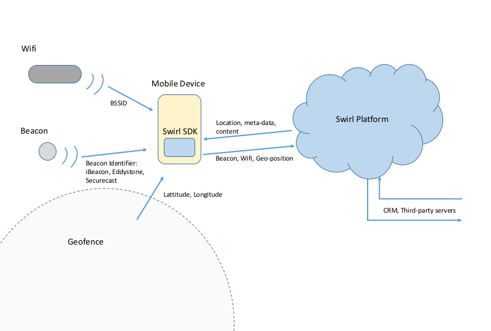

**PRE-RELEASE DOCUMENTATION - All information is subject to change**

---

# Swirl Proximity SDK (iOS)
The Swirl platform is designed as a complete proximity platform detecting a variety of proximity signals like geofence, wifi and beacons and managing presence tracking, notification and content delivery.  The Swirl SDK is a component of this system which enables signal detection on mobile devices.

### Features
* Simple Interface, Easy to integrate
* Small footprint, native implementations
* Geofence: circular and arbitrary polygons
* Wifi: Enables access points to be used like beacons or geofences
* Beacon: SecureCast™, Eddystone (URL, UID, EID, TLM) and iBeacon, easy to extend
* Content: Support for interstitials, deep links and custom content types (optional)

## Additional Resources
In addition to this guide, Swirl offers a number of additional resources to help you during and after the integration process to help ensure the best results for you and your users.
* For implementation:
 * [API Reference Documentation](https://SwirlNetworks.github.io/swirl-sdk-ios/index.html)
 * [Example Source Code](./examples/)
* For testing:
 * [Explorer in the App Store](https://itunes.apple.com/us/app/swirl-in-store-explorer/id781067361?mt=8) which can be used for testing signals and content.
 * [BeaconManager in the App Store](https://itunes.apple.com/us/app/swirl-beacon-manager/id855322103?mt=8) which can be used to configure and deploy beacons.
 * [Customer Supoprt: support@swirl.com](mailto:support@swirl.com) Support and Testing Services. Swirl appreciates publishers willing to share their integrated application for Swirl testing. This is an added service that we provide you to ensure that your app has been properly integrated with our SDK. Please contact your Swirl Account Manager to schedule this testing.

## Release Notes
**Version:** `3.0-beta1` &nbsp;&nbsp;&nbsp;&nbsp;&nbsp;&nbsp;&nbsp;&nbsp;&nbsp;&nbsp;&nbsp;&nbsp;**Date:** `7/22/16`

This is the initial release of sdk3. sdk3 represents a completely rearchitected and rewritten code base for both iOS and Android.  As this is pre-release software, it has a number of bugs and issues which are highlighted below and remains subject to changes in functionality and interfaces.  If you have access to this repository, it is likely because we are hoping for feedback.

#### Known Issues
 1. issue one
 2. issue two

#### Reporting Issues
All issues can be reported to [tom@swirl.com](mailto:tom@swirl.com)

## License
We have included our standard commercial [license](LICENSE.md), but this repository is public currently for technical reasons ONLY and its accessibility should not be considered a grant of any rights.  Please see [Swirl](https://www.swirl.com) for more details or email us at [sales@swirl.com](mailto:sales@swirl.com) if you are interested in using our products.

